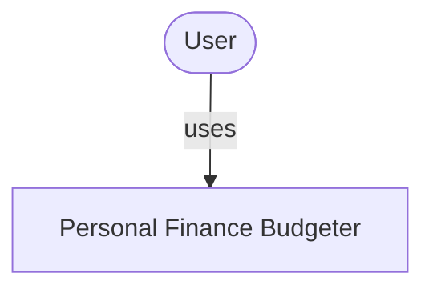
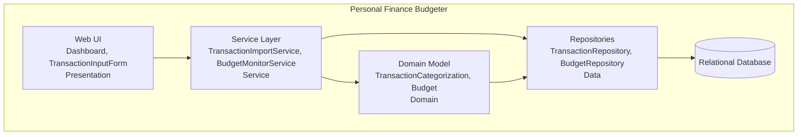
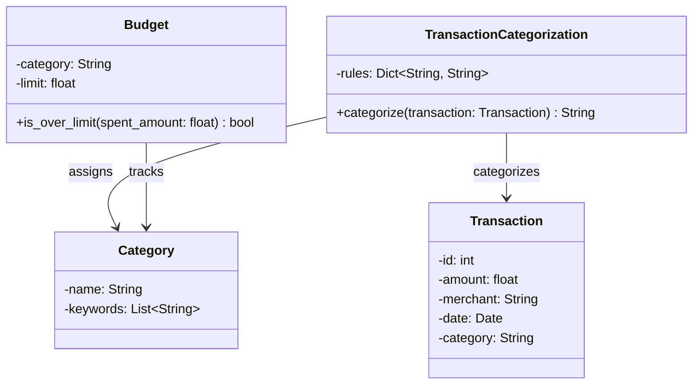
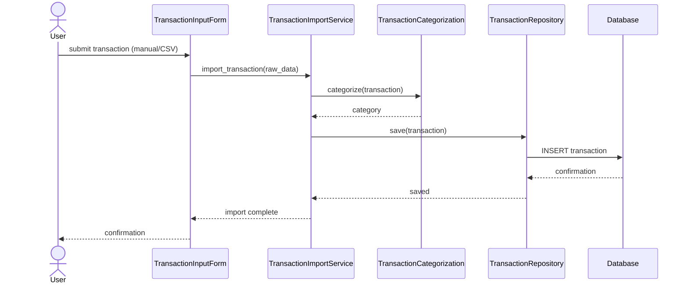

# Personal Finance Budgeter

<!-- CI badge: after Session 4, replace ORG/REPO and the workflow filename, then uncomment:

-->

**Student:** Deijen Severino · **Course:** CEN 5064 Software Design, Fall 2026 · **Partner:** @Eshim003

## Project (approval paragraph — write this by Sun Aug 30)

Project: Personal Finance Budgeter

This system is a personal finance budgeter that helps users understand and control their spending by automatically organizing transactions into categories. It is designed for individuals who want a lightweight, self-hosted way to track expenses without relying on a bank-linked app. The system supports four core features: (1) transaction import (manual entry or CSV upload), (2) a rule-based categorization engine that matches transactions to categories using keyword/merchant matching with an "Uncategorized" fallback, (3) budget limits per category with threshold alerts when spending approaches or exceeds the limit, and (4) a spending dashboard that visualizes trends over time. The system will use a layered architecture (Presentation → Service → Domain → Data) backed by a single relational database, with a minimal web UI for interaction.

## How to run

```
[Exact commands to build and run your system from a clean clone.
Update this every time the steps change — your partner and your
instructor will follow it literally on conference days.]
```

## Architecture

### Tier breakdown (Session 2 studio)

| Tier | Responsibilities in THIS system |
|------|--------------------------------|
| Presentation | [what your UI layer does] "Dashboard" - Dashboard UI for spending trends, "TransactionInputForm" - plus the transaction input forms (manual entry, CSV upload) |
| Service | [what your use-case/orchestration layer does] "TransactionImportService" - Orchestrates use cases: import flow (parse → categorize → save), and "BudgetMonitorService" - budget monitoring (check transactions against budget rules, trigger alerts) |
| Domain | [your entities and business rules] "Transaction" - represents an imported transaction (amount, merchant, date, category), "Category" - represents a spending category and its matching keywords, "TransactionCategorization" - (keyword/merchant rules, uncategorized fallback) and "Budget" - Budget (limit, threshold, over-limit check) |
| Data | [how and where data is stored] "TransactionRepository", "BudgetRepository" Repositories for Transaction, Category, and Budget records against the relational database |

### C4 — Context & Container (Session 3 studio)





### UML — Class & Sequence (Session 3 studio)





## Architecture Decision Records

Decisions live in [`docs/adr/`](docs/adr/). Start with ADR-001 in Session 4.

| # | Decision | Status |
|---|----------|--------|
| [001](docs/adr/adr-001.md) | [What I am building and why] | [proposed] |

## Weekly log (optional but recommended)

A one-line note per week keeps your commit story readable:

- Week 1 (Aug 24): repo created, three ideas drafted
- Week 2 (Aug 31): ...


## Known Issues

- Importing Transactions Feature
